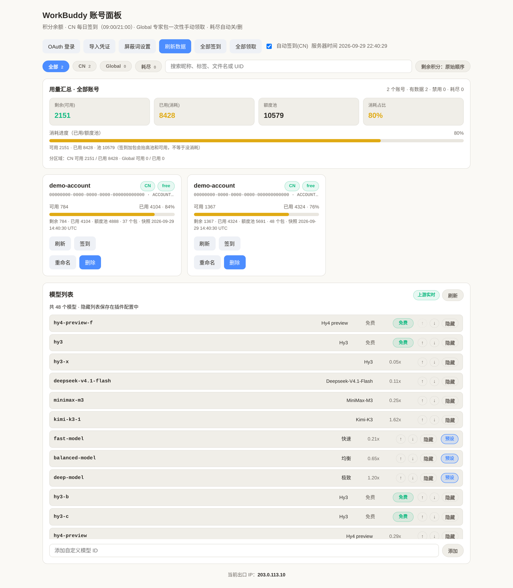

# WorkBuddy CPA Plugin

[CLIProxyAPI (CPA)](https://github.com/router-for-me/CLIProxyAPI) 插件：把 **腾讯 CodeBuddy / WorkBuddy**
（`copilot.tencent.com` CN 与 `workbuddy.ai` Global）接成 CPA 的原生 OAuth Provider。

单插件仓库，只做 WorkBuddy 一件事。功能、构建与配置见 [workbuddy/](workbuddy/)。



## 能力

| 项 | 说明 |
|---|---|
| OAuth 登录 | 多账号 `workbuddy-<uid>.json`，CN 与 Global 共用同一插件与同一配置块 |
| 模型目录 | 默认按账号动态发现并缓存；可选 YAML 权威清单覆盖发现；缺失元数据从 models.dev 补全。面板「刷新」会带 `?refresh=1` 丢弃缓存并重新向上游发现（拉取失败时保留上一次可用目录并明确提示）。宿主 alias/exclusion 仍生效，插件另有持久化 `hidden_models` 过滤 |
| Executor | OpenAI 兼容 chat completions，流式（真 SSE）与非流式都支持 |
| 积分生命周期 | CN 账号积分耗尽自动 disable，签到恢复后自动启用；Global 账号耗尽即删除 |
| 每日签到 | CN 账号本地时间 09:00 / 21:00 自动签到，面板可手动「全部签到」 |
| Global 专家包 | 面板手动领取一次性专家加油包 |
| 屏蔽词混淆 | 可选的 U+200B 混淆（`desensitize`），词表可编辑且持久化，默认关闭 |
| 按模型冷却 | 单个 (账号, 模型) 触发限流时只冷却该组合，不冻结整个账号 |
| 用量上报 | 可选把用量转发到自建 `/usage` 端点（`usage_report_url`） |
| 管理面板 | 账号、积分、模型状态一页可见，支持搜索、排序与多文件导入 |

## 安装

从 Release 下载对应平台产物，放进 CPA 的 `plugins` 目录：

```bash
unzip workbuddy_0.9.6_linux_amd64.zip
cp workbuddy.so /path/to/cliproxyapi/plugins/workbuddy.so
# 或平台子目录布局：plugins/linux/amd64/workbuddy.so
```

在 `config.yaml` 启用：

```yaml
plugins:
  enabled: true
  dir: "plugins"
  configs:
    workbuddy:
      enabled: true
```

可选的插件配置项（`models`、`checkin_auto`、`desensitize`、`proxy-url` 等）说明见
[workbuddy/README_CN.md](workbuddy/README_CN.md)。

插件是 `-buildmode=c-shared` 且启用 CGO，需要在 CPA 实际运行的平台上构建。

## 构建

```bash
cd workbuddy
make build      # 产出 dist/workbuddy.<so|dylib|dll>
make test
```

也可以直接用 Go：

```bash
CGO_ENABLED=1 go build -trimpath -buildmode=c-shared -o workbuddy.so .
```

多架构产物与 Release 由 CI 在 tag `workbuddy-v*` 时构建。

## Credits / 来源

本仓库是 [`Sliverkiss`](https://github.com/Sliverkiss) 的 `cpa-plugin`
（内含 WorkBuddy / CodeBuddy provider）的 fork，当前由 **bfSan** 维护。

- **Sliverkiss** — 上游 `cpa-plugin` 的作者，最初把 CodeBuddy / WorkBuddy 接入 CPA；
  本插件的 OAuth 流程与执行器源自其实现。
- **lovingfish** — 更早的 `workbuddy` 实现作者，Sliverkiss 的版本基于其工作。
- **hurleychin**、**AllenReder**、**luode0320** 等 — 上游 fork 生态中的其他实现，
  本插件在设计阶段审计过它们的签到、headers 与动态模型方案。

> 说明：上游仓库 `Sliverkiss/cpa-plugin` 目前返回 404（已被作者删除或转为私有），
> 因此本 README 与插件元数据中的仓库地址均指向本 fork，不再指向已失效的上游链接。
> 原始署名保留在源码文件头与插件 `Author` 字段中。

## 许可

MIT，见 [workbuddy/LICENSE](workbuddy/LICENSE)。
